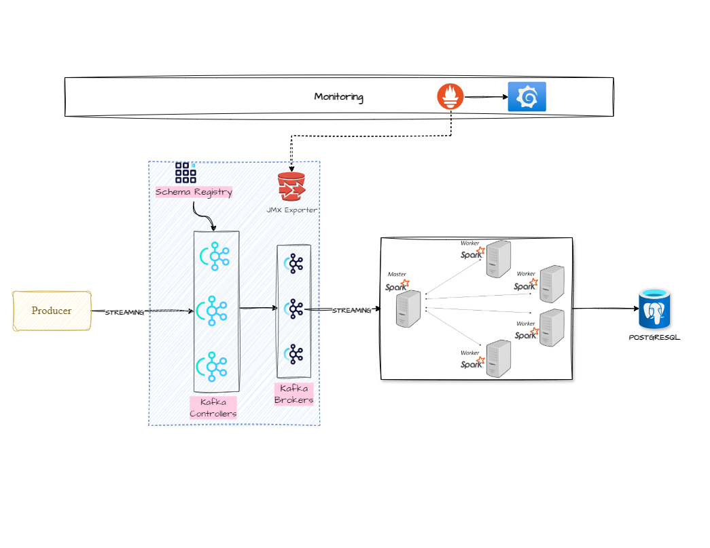

# Transactional Data Pipeline

## 📚 Overview
This project is a **real-time transactional data pipeline** that ingests dummy transactional data, processes it, and stores the results for further analysis. The pipeline uses open-source technologies such as Kafka, Spark, and PostgreSQL to handle streaming and batch data effectively.

---

## 📸 Architecture Diagram


---

## ⚙️ Tech Stack
- **Kafka**: Acts as a distributed event streaming platform to handle real-time data ingestion.
  - Kafka Controllers manage the metadata and maintain cluster coordination.
  - Kafka Brokers distribute and handle incoming and outgoing data streams.
  - **Schema Registry** ensures that the data adheres to a predefined schema to avoid inconsistencies.
- **Spark**: Processes data in real-time by consuming messages from Kafka.
  - A **Spark Master** node manages and distributes tasks across multiple **Spark Worker** nodes.
- **PostgreSQL**: Stores the processed data for further analysis and reporting.
- **Prometheus & Grafana**: Monitors the performance and health of the Kafka and Spark clusters.
  - **JMX Exporter** collects and exposes Kafka metrics to Prometheus.
  - Grafana visualizes metrics for real-time system health monitoring.

---

## 📈 Workflow
1. **Producer** sends real-time dummy transactional data to Kafka.
2. Kafka Controllers and Brokers ensure data is distributed and stored correctly.
3. Spark processes streaming data from Kafka.
4. Processed data is stored in PostgreSQL for further analysis.
5. Prometheus collects system metrics from Kafka, and Grafana visualizes these metrics.

---

## 🚀 Setup Instructions

### Prerequisites
- Docker & Docker Compose
- Java 8+ (for Spark and Kafka)
- Python (optional for additional scripts)

### Step 1: Clone the Repository
```bash
git clone https://github.com/your-repo-name.git
cd your-repo-name
```

### Step 2: Start Docker Containers
```bash
docker-compose up -d
```

### Step 3: Verify Kafka and Spark
- Access Kafka UI: `http://localhost:8080`
- Access Spark UI: `http://localhost:4040`

### Step 4: View Monitoring
- Prometheus: `http://localhost:9090`
- Grafana: `http://localhost:3000`

---

## 📊 Monitoring and Visualization
- **Prometheus** scrapes Kafka and Spark metrics.
- **Grafana** visualizes real-time system health with pre-configured dashboards.

---

## 📝 Directory Structure
```
.
├── docker-compose.yml
├── architecture.png
├── jmx
│   ├── jmx_prometheus_javaagent.jar
│   └── kafka-broker.yml
├── jobs
│   └── spark_processor.py
├── monitoring
│   ├── grafana
│   └── prometheus
├── main.py
└── README.md
```

---

## 📝 Future Enhancements
- Expand the structure to support a **crypto data pipeline** for future enhancements.
- Integrate alerting mechanisms in Grafana.
- Add more advanced metrics for crypto spaces.

---

## 👨‍💻 Author
**Bharath Devarajan**  
Feel free to reach out for any suggestions or improvements!

---

## 💃 License
This project is licensed under the MIT License - see the [LICENSE](LICENSE) file for details.

